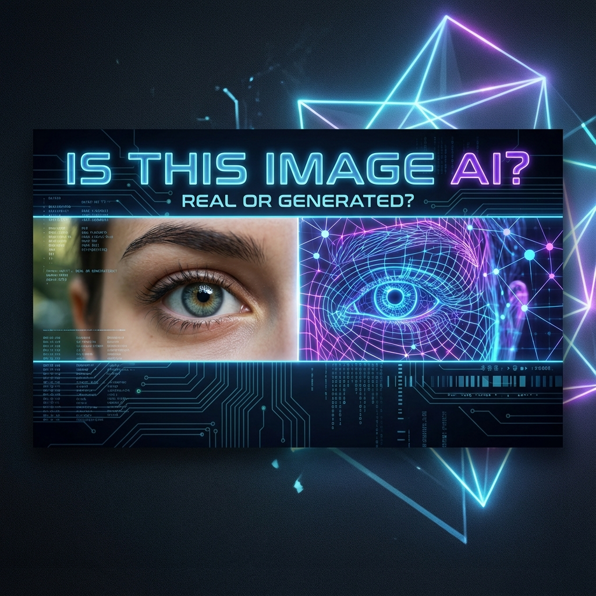

# Is This Image AI?

**Is This Image AI?** is a powerful, client-side tool designed to help you detect whether an image was generated by Artificial Intelligence.

## 🚀 Features

- **Client-Side Analysis**: All processing happens directly in your browser. Your images are never uploaded to a server, ensuring complete privacy.
- **Advanced Detection Algorithms**: Utilizes Error Level Analysis (ELA) and Frequency Analysis to identify artifacts common in AI-generated images.
- **Metadata Inspection**: Checks for missing or suspicious metadata often associated with AI generation tools.
- **Instant Results**: Get immediate feedback on the likelihood of an image being AI-generated.

## 🛠️ Tech Stack

- **Framework**: [Next.js](https://nextjs.org)
- **Styling**: [Tailwind CSS](https://tailwindcss.com)
- **Icons**: [Lucide React](https://lucide.dev)
- **Deployment**: [Vercel](https://vercel.com)

## 🏁 Getting Started

First, run the development server:

```bash
npm run dev
# or
yarn dev
# or
pnpm dev
# or
bun dev
```

Open [http://localhost:3000](http://localhost:3000) with your browser to see the result.

## 🤝 Contributing

Contributions are welcome! Please feel free to submit a Pull Request.

## 📄 License

This project is open source and available under the [MIT License](LICENSE).
